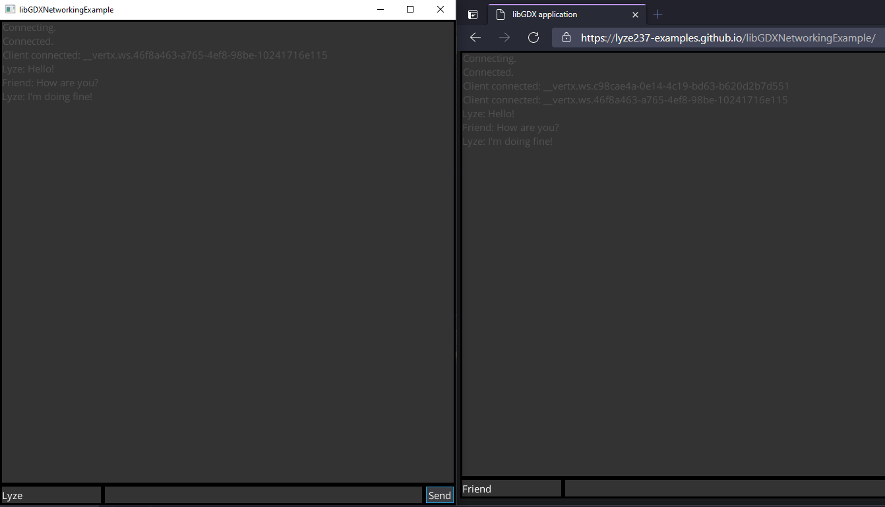
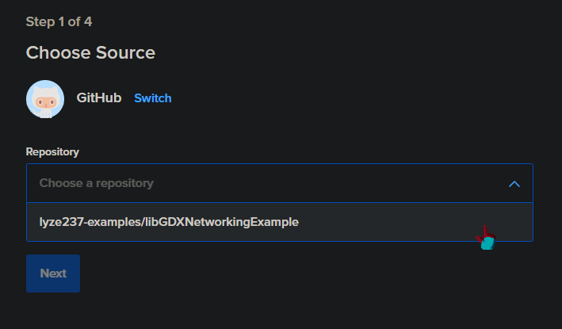
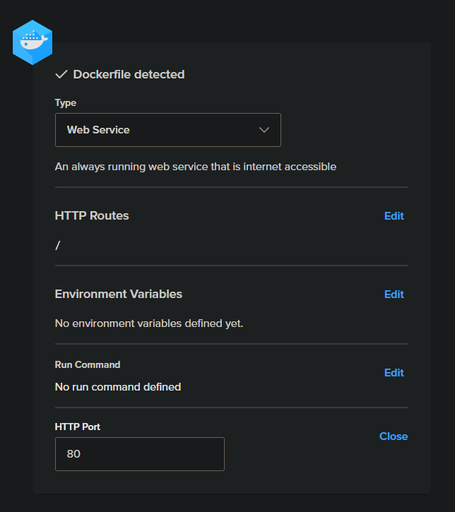
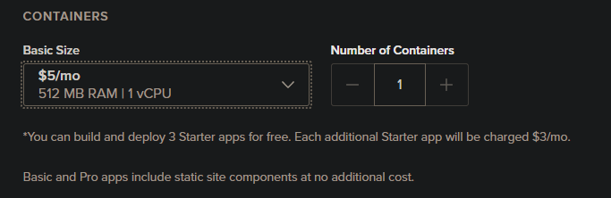
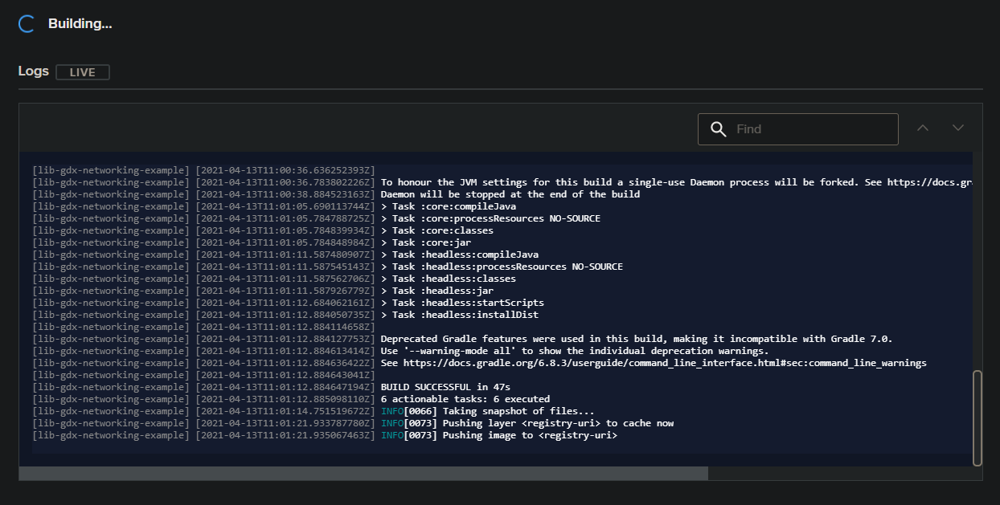
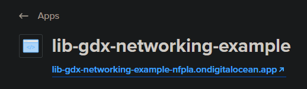

### Since there is no free tier, the server isn't running anymore.

---

# libGDX Networking Example

It's really simple to deploy the headless version of the libgdx project to digital ocean's app platform.

For this I've generated a libgdx project with [liftoff](https://github.com/tommyettinger/gdx-liftoff), an alternative setup tool which is much more powerful with the following platforms:
* Lwjgl3
* Headless
* Html

As html only supports websockets (and once you run it outside of localhost, only secure websockets) we're a bit limited and can't use popular libraries like [kryonet](https://github.com/EsotericSoftware/kryonet/).

Luckily there's a couple useful libraries for that:
* Client: [gdx-websockets](https://github.com/MrStahlfelge/gdx-websockets)
* Server: [Vert.x](https://vertx.io/)

### Server

1. The only thing you need is a [Dockerfile](Dockerfile), which is a simple gradle build and a run of the application.

2. Then you simply register an account, create a [new app](https://cloud.digitalocean.com/apps/new)

3. Link your repository

4. Specify the internal port the web server uses in your program.

5. Define the size and how much you want to pay.

6. Wait until it's done building.

7. Once it's done building you'll get an url, make sure that the client connects to this one.

That's basically all you need to do.

### Client

I've set up the html build to be [automatically deployed to github pages](.github/workflows/gwt.yml), so it's available for everyone to use without costing money.

Alternatively you could also add a static site in digital ocean to the app service, so you have everything in one place.

